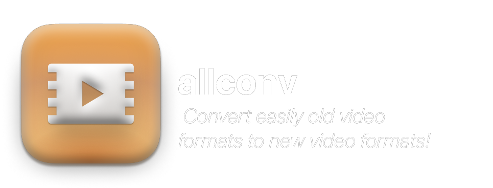
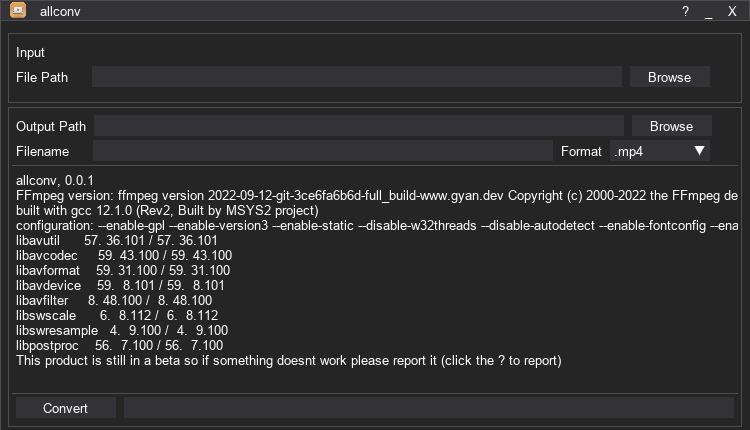

---


In these times YouTube Converter are just filled with ads, are slow or not working. This is the perfect alternative.




## Installation

  1. Download [``allconv-Setup.exe``](https://github.com/philliphqs/allconv/releases/download/0.0.2-alpha/YouTube-Converter-Setup.exe)
  2. Run [``allconv-Setup.exe``](https://github.com/philliphqs/YouTube-Converter/releases/download/0.0.2-alpha/YouTube-Converter-Setup.exe)

## Clone Repository

```sh
git clone https://github.com/philliphqs/YouTube-Converter.git
```

## Release History

* 0.0.1-alpha
    * Prototype

## Coming features
* 0.0.2-alpha
  * ...

## Meta

philliphqs – [@phillip_hqs](https://twitter.com/philliphqs) – [philliphqs@protonmail.com](mailto:philliphqs@protonmail.com)

Distributed under the MIT license. See ``LICENSE`` for more information.

<a href="https://www.buymeacoffee.com/phillip.hqs"></a>

## Contributing

1. Fork it (<https://github.com/philliphqs/allconv/fork>)
2. Create your feature branch (`git checkout -b feature/fooBar`)
3. Commit your changes (`git commit -am 'Add some fooBar'`)
4. Push to the branch (`git push origin feature/fooBar`)
5. Create a new Pull Request
